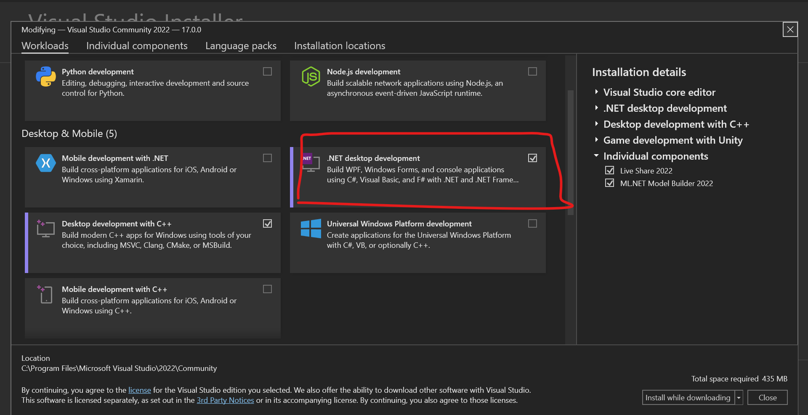

# AirEngine
AirEngine is a easy and lightweight game engine as its name. It is made with C# and only! By cloning it, you get the main engine file, which lies in directory "AirEngine\AirEngine\AirEngine"(three same-name folders :): [AirEngine](https://github.com/nikeedev/AirEngine/blob/main/AirEngine/AirEngine/AirEngine/AirEngine.cs)

Demo file to engine are called "DemoGame.cs" where you can get a demo of how-to: change background color to the window, the title of the window or the size, simple and easy, and even understandable.
Demo file is runned by "main.cs" so you can run all other processes. 

--------
## Installation and run engine:

First you must have .NET Core installed(very good if you get it on .NET Core 4.8) and also Visual Studio. Have Desktop Development for .NET: 

**Then:**

*Step 1. Clone repo:*
                  If you clone repo, after cloning, follow step 3.
                  
*Step 2. Download Zipped:* 
                  Unzip zip file to repo, and follow step 3.
                  
*Step 3.(The last one) Open Solution:*
                  Open engine repo folders, and open "AirEngine.sln" and happy game development!!!  

--------
### Help or support by
This cool dude, and his youtube channel: [Expressed Unity](https://www.youtube.com/channel/UCIhFKOg3119gMqAJEqxeePA) using one of his videos: [
C# Basic 2D Game engine from scratch!](https://www.youtube.com/watch?v=JnGM1p2vsbE)
